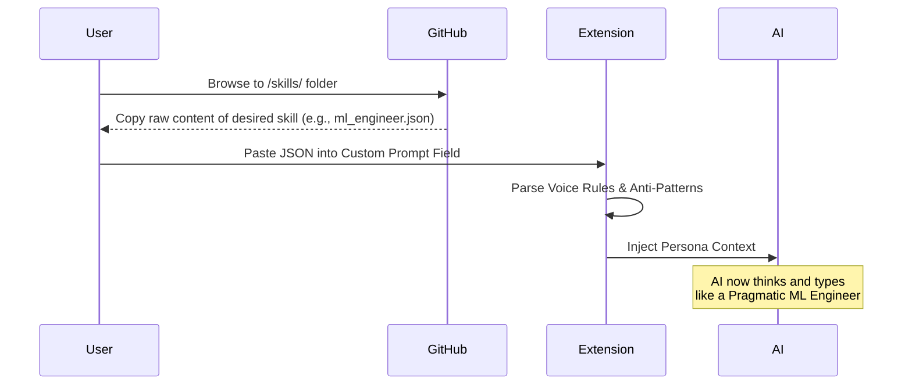
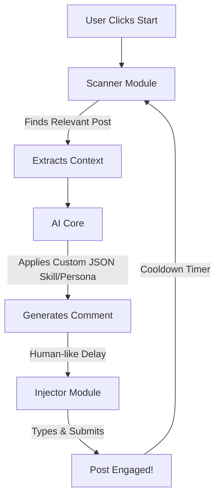

# 🚀 CyberEthic: AI Commenter for LinkedIn

**The Ultimate AI-Powered Engagement Assistant for Professionals**

**CyberEthic AI Commenter** is more than just a browser extension it is a complete growth engine designed to automate your personal branding and supercharge your engagement on professional networking platforms. 

---

## 📑 Table of Contents
- [🚨 The Problem](#-the-problem)
- [💡 The Solution & Impact](#-the-solution--impact)
- [✨ Core Features](#-core-features)
- [🎭 Available AI Skills (Personas)](#-available-ai-skills-personas)
- [🧠 How to Use Skills](#-how-to-use-skills)
- [⚙️ How It Works (Architecture)](#️-how-it-works-architecture)
- [🤝 Join the Movement (Contribute)](#-join-the-movement-contribute)
- [📥 Installation](#-installation)

---

## 🚨 The Problem: The Engagement Trap

In 2025, building a personal brand on LinkedIn is no longer optional it's a fundamental requirement for career growth, B2B sales, and thought leadership. However, the system is fundamentally broken for busy professionals. Let's face the reality:

1. **The Algorithm is Exhausting:** LinkedIn's algorithm heavily rewards *constant*, daily engagement. If you aren't leaving 20-30 high-quality comments a day, your own posts get buried, and your profile visibility drops to zero. Missing just a few days of engagement can kill months of hard work.
2. **"Great Post!" is Dead (And Harmful):** In the past, you could get away with copy-pasting generic comments like *"Thanks for sharing!"* or *"I completely agree."* Today, not only do other users ignore these empty comments, but LinkedIn's spam filters actively penalize your account reach for using them. You must add genuine value.
3. **The Massive Time Sink:** To leave a *real* comment, you have to read a 500-word post, understand the author's nuanced perspective, formulate an intelligent counter-point or supportive insight, and type it out. Doing this for 50 posts takes **2 to 3 hours out of your productive workday.** 
4. **The Mental Fatigue:** Context-switching between your actual job and trying to be witty or insightful on a social feed leads to massive burnout. 

**The Result?** Highly talented professionals founders, senior engineers, directors simply give up. They stop engaging entirely, handing over massive career, sales, and networking opportunities to competitors who have more free time.

---

## 💡 The Solution & Impact: Intelligent Automation

**CyberEthic AI Commenter** completely eliminates the "Engagement Trap". It solves the problem by putting your networking on safe autopilot, while maintaining 100% of your authentic, professional voice. We don't just automate clicks; we automate *contextual understanding*.

Here is how CyberEthic changes the game for you:

🚀 **Save 15+ Hours a Week:** Stop losing your mornings to scrolling. Let the AI read the posts, analyze the nuances, and write the comments. You get your time back to focus on deep, meaningful work while your digital twin networks for you.
🎯 **Trigger Meaningful Conversations:** The AI is specifically prompted (via our custom JSON skills) to ask thought-provoking questions and provide unique industry insights. Instead of being ignored, post authors will actively reply to your comments and send you connection requests.
📈 **Scale Your Reach Exponentially:** Engage with 10x more posts daily without any mental fatigue. More high-quality comments mean more profile views, more inbound leads, and higher algorithmic reach for your own content.
🛡️ **100% Safe, "Anti-Bot" Architecture:** We built this for professionals who value their accounts. CyberEthic runs locally in your browser. It mimics human typing speeds, pauses randomly, takes cooldown breaks, and intelligently skips sensitive posts (like tragedies or layoffs) to ensure you never look like a bot.

---

## ✨ Core Features

- **🧠 State-of-the-art Context Engine:** The AI doesn't just read the text; it understands the *sentiment*, *industry*, and *intent* of the original post before writing a single word.
- **🔄 Smart Auto-Scroller:** Automatically scrolls your feed, intelligently skips irrelevant posts (like tragedies, hiring posts, or ads), and engages only with high-value content.
- **🛡️ Enterprise-Grade Safety:** Runs securely within your local browser. It mimics human typing speed, includes randomized cooldown timers, and pauses automatically to keep your account 100% safe.
- **🌐 Multi-Platform Ready:** Designed natively for **LinkedIn** with active beta development to support Facebook, X (Twitter), and Reddit in future updates.
- **🎨 Infinite Customization (Personas):** Don't sound like a robot. Use our JSON-based *Skill Engine* to inject specific instructions, anti-patterns, and voice rules so the AI sounds exactly like you.

---

## 🎭 Available AI Skills (Personas)

CyberEthic Engage supports injecting custom instructions into the AI via `.json` configuration files. We have provided **15 highly effective, hyper-realistic templates** out of the box.

👉 **[Browse the Skills Directory Here](https://github.com/Faizan-Khanx/AI-Commenter-for-LinkedIn/tree/main/skills/)**

| Persona / Skill | Best For | Description |
| :--- | :--- | :--- |
| 🧑‍💻 [**ML Engineer**](https://github.com/Faizan-Khanx/AI-Commenter-for-LinkedIn/tree/main/skills/ml_engineer.json) | Tech / AI Posts | Pragmatic engineer focused on compute costs, inference, and real-world deployment. |
| 🔒 [**Cyber Security Analyst**](https://github.com/Faizan-Khanx/AI-Commenter-for-LinkedIn/tree/main/skills/cyber_security.json) | InfoSec / Cloud | Cautiously pessimistic InfoSec analyst discussing zero-days and SOC. |
| ⚙️ [**DevOps / SRE**](https://github.com/Faizan-Khanx/AI-Commenter-for-LinkedIn/tree/main/skills/devops_sre.json) | Infra / CI-CD | Tired engineer managing K8s, who hates downtime and loves automation. |
| 🤝 [**HR / Talent Acquisition**](https://github.com/Faizan-Khanx/AI-Commenter-for-LinkedIn/tree/main/skills/hr_talent_acquisition.json) | Layoffs / Hiring | Genuine empathy for the job market, drops the corporate facade. |
| 💼 [**B2B Sales (No Pitch)**](https://github.com/Faizan-Khanx/AI-Commenter-for-LinkedIn/tree/main/skills/b2b_sales_executive.json) | B2B / Sales | Natural, non-pushy sales persona that builds relationships through observation. |
| 🧠 [**Thought Leader**](https://github.com/Faizan-Khanx/AI-Commenter-for-LinkedIn/tree/main/skills/thought_leadership.json) | Industry Trends | Slightly contrarian but respectful perspective. Avoids the echo chamber. |
| 💻 [**Senior Software Engineer**](https://github.com/Faizan-Khanx/AI-Commenter-for-LinkedIn/tree/main/skills/software_engineer.json) | Coding / Dev | Cares about maintainability, testing, and avoids tech hype. |
| 🚀 [**Startup Founder**](https://github.com/Faizan-Khanx/AI-Commenter-for-LinkedIn/tree/main/skills/startup_founder.json) | Bootstrapping / MVP | Empathy for the founder struggle, action-oriented, and humble. |
| 📊 [**Data Scientist**](https://github.com/Faizan-Khanx/AI-Commenter-for-LinkedIn/tree/main/skills/data_scientist.json) | Big Data / Stats | Analytical, evidence-based, appreciates good visualizations. |
| 🎯 [**Marketing Strategist**](https://github.com/Faizan-Khanx/AI-Commenter-for-LinkedIn/tree/main/skills/marketing_strategist.json) | Brand / SEO | Focuses on ROI, metrics, and appreciates good storytelling. |
| 📦 [**Product Manager**](https://github.com/Faizan-Khanx/AI-Commenter-for-LinkedIn/tree/main/skills/product_manager.json) | Agile / Roadmaps | User-centric approach, focuses on cross-functional collaboration. |
| ❤️ [**Customer Success**](https://github.com/Faizan-Khanx/AI-Commenter-for-LinkedIn/tree/main/skills/customer_success.json) | Retention / Onboarding| Empathetic, positive, and customer-centric problem solver. |
| 🌍 [**Diversity Advocate**](https://github.com/Faizan-Khanx/AI-Commenter-for-LinkedIn/tree/main/skills/diversity_advocate.json) | DEI / Culture | Promotes healthy workplace cultures, mental health, and inclusion. |
| 🔍 [**Talent Scout**](https://github.com/Faizan-Khanx/AI-Commenter-for-LinkedIn/tree/main/skills/recruiter_talent_scout.json) | Open-to-work | Encouraging and observant recruiter building a pipeline of top talent. |
| ⚡ [**Short Appreciation**](https://github.com/Faizan-Khanx/AI-Commenter-for-LinkedIn/tree/main/skills/short_appreciation.json) | General Posts | Rapid, encouraging 4-5 word comments with a single emoji. |

---

## 🧠 How to Use Skills

You can easily inject these personas into the CyberEthic extension. Copy the JSON content of your desired skill and paste it into the extension's prompt configuration.

---

## ⚙️ How It Works (Architecture)

---

## 🤝 Join the Movement (Contribute)

CyberEthic AI Commenter isn't just a tool; it's a community of professionals working smarter. We want to build the largest open-source collection of professional AI personas on the internet. 

**This repository is dedicated entirely to hosting our open-source Custom Skills & Templates.**

### How You Can Contribute:
Do you have a unique professional voice? Are you a Lawyer, a Real Estate Agent, or a Graphic Designer? 
1. **Fork this repository.**
2. **Create a new `.json` skill** in the `/skills` folder. Look at the existing ones for the structure (voice rules, anti-patterns, seeds).
3. **Open a Pull Request.** If your persona is unique, helpful, and human-like, we will merge it and feature it in the official table above!

### 🌟 Our Incredible Contributors

A massive thank you to everyone who is helping build this prompt library. Join us!

---

## 📥 Installation

Ready to put your engagement on autopilot? The extension is officially available on browser stores. You do not need to download any code.

- **Google Chrome Web Store:** [Link coming soon]
- **Opera Add-ons:** [Link coming soon / Download from store]
- **Mozilla Firefox Add-ons:** [Link coming soon]

 
<b>Developed with ❤️ by CyberEthic</b> 
Website: <a href="https://cyberethic.in">cyberethic.in</a>

